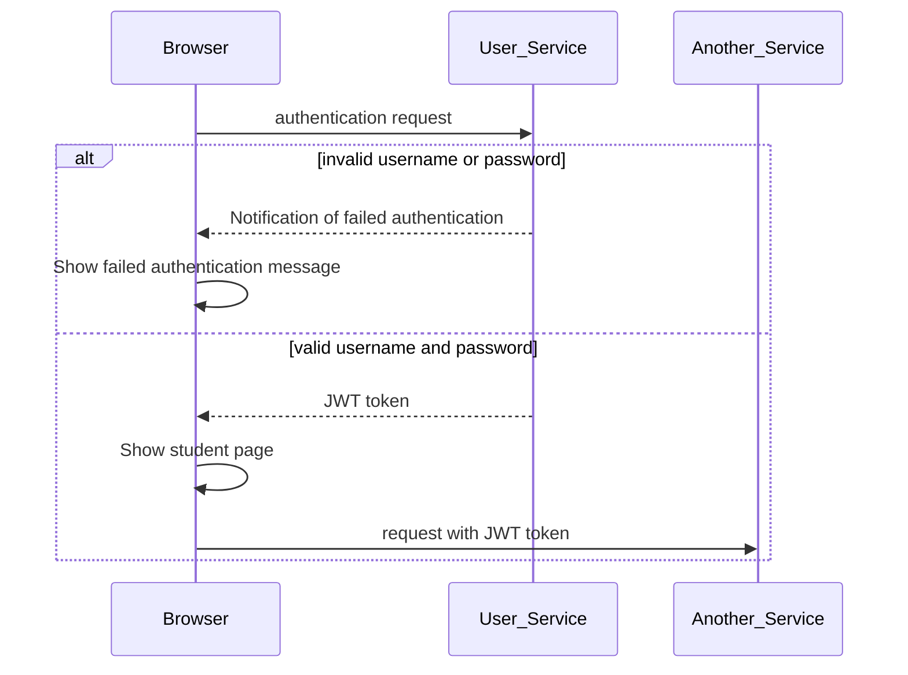

# Sub-domains
+ admin.endeavor.com
+ teach.endeavor.com
+ study.endeavor.com

# User service
+ user admin APIs: create, read, update, delete
+ authentication: JWT

# Admin service
+ user admin APIs
+ create course
+ approve change requests
+ publish course
+ student-course permission
+ teacher-course permission

# Teacher service
+ submit change requests 
+ search and suggestion

# Course service
+ list courses
+ preview courses
+ list lessons

# Lesson service
+ preview lesson
+ modify lesson
+ study lesson

# Word service

# Grammar service

# Deck service