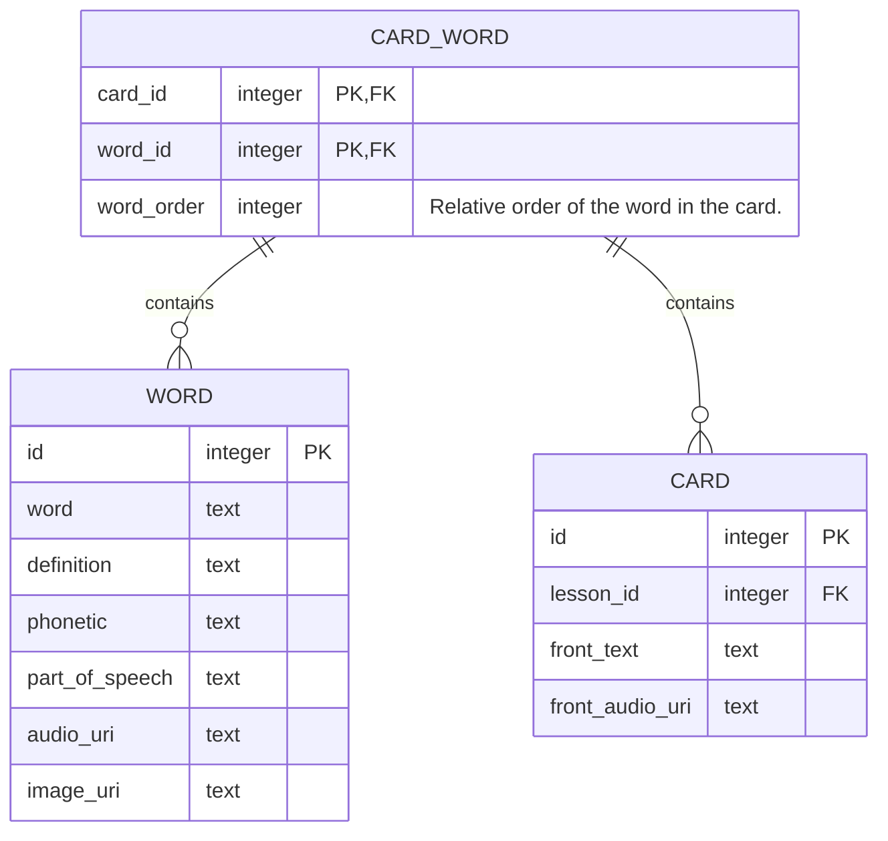

# CARD

```mermaid
erDiagram
  CARD {
    id              integer   PK
    lesson_id       integer   FK
    front_text      text
    front_audio_uri text
  }

  WORD {
    id              integer   PK
    word            text
    definition      text
    phonetic        text
    part_of_speech  text
    audio_uri       text
    image_uri       text
  }

  CARD_WORD {
    card_id         integer   PK,FK
    word_id         integer   PK,FK
    word_order      integer         "Relative order of the word in the card."
  }

  CARD_WORD ||--o{ WORD : contains
  CARD_WORD ||--o{ CARD : contains
```
