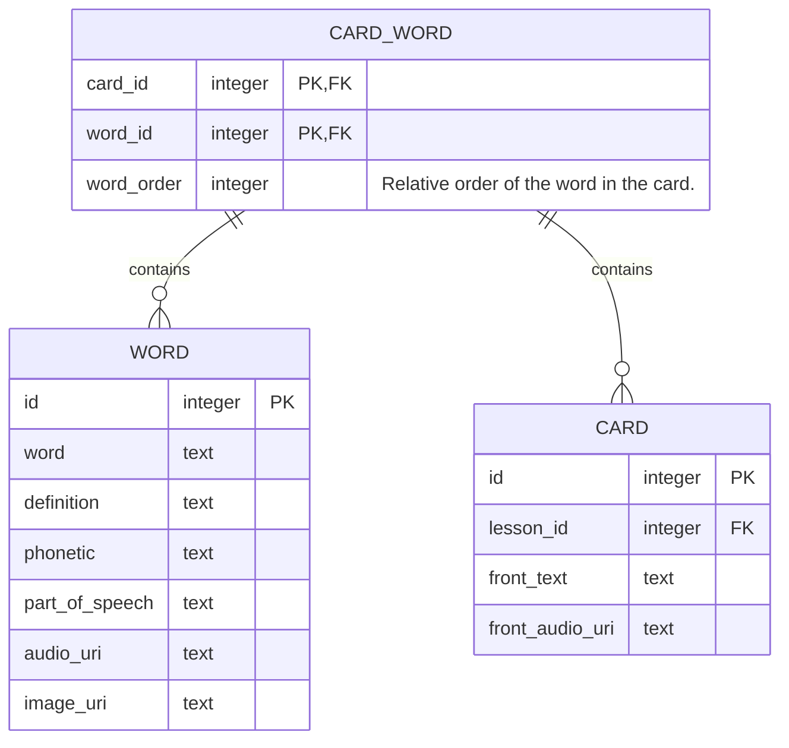

# CARD

## Data modeling

## Add card
+ add front text
  + the front text is added to `addCard` request body
+ select a word/phrase and mark it as new word
  + `#` is added on both sides of the word
  + the Suggestion List is shown below 
    + result populated with `searchWord` (full-text search)
    + search field can be edited
  + select one of the suggested words
    + the word is added to `addCard` request body
  + click the Add New Word
    + the Add New Word dialog is shown
    + enter word info and click Add
      + `createWord` is called
      + the word is added to `addCard` request body
+ upload front audio (optional)
  + `uploadAudio` is called
  + the audio_uri is added to `addCard` request body
+ click Add --> `addCard`
  + front text is Sanitize (e.g. html tags are not allowed) to prevent XSS, etc. 
  + `addWordToCard` is called
