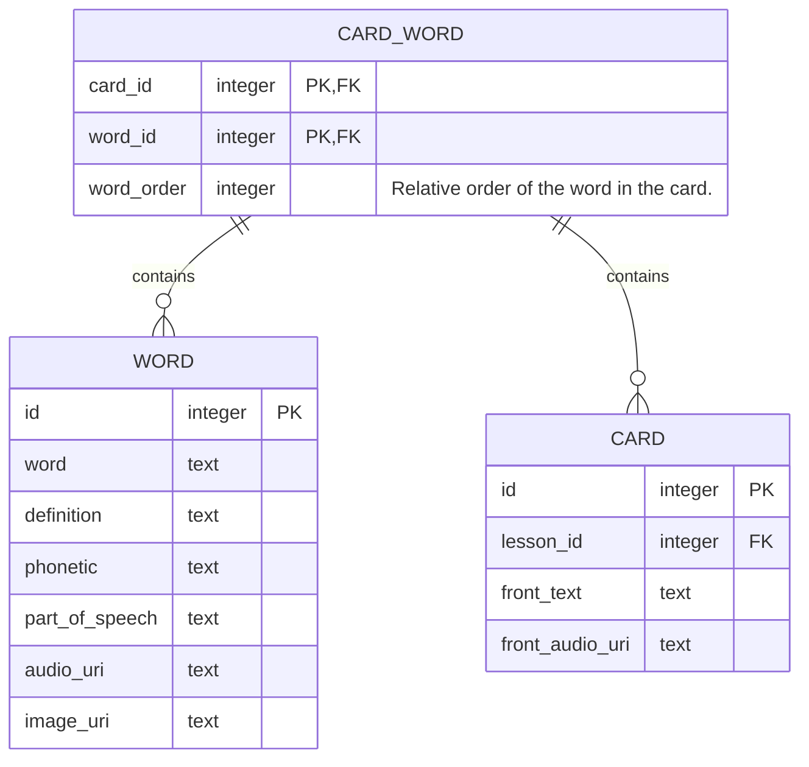

# CARD

## Data modeling

## Add card
+ Add front text. 
+ Select a word/phrase and mark it as new word
  + `#` is added on both sides of the word
  + suggestions dialog is shown with result populated with `searchWord`
  + show  (full-text search), search field can be edited.
+ Select one of the suggested words --> `addWordToCard`
+ Select Add Word instead --> Add Word Dialog --> `createWord`
+ Optional: upload front audio
+ Click create --> `createCard`
    + Sanitize front text to prevent XSS, etc: html tags are not allowed.
