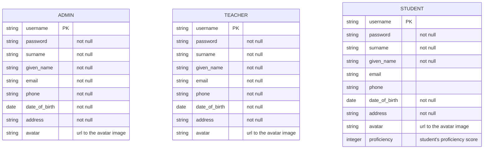

## ADMIN, TEACHER, and STUDENT

//TODO: consider using Hierarchical Database  
Teacher and student accounts are created and managed by admins.  
There are 3 sub-domains having independent authentication/authorization needs. Therefore, 3 separate database tables are used.  
Basic authentication is used, as it is simple but sufficient.

### Primary Key and Login Username

Email is not chosen as login username because young students may not have emails. UUID is difficult to remember. So for each student, a unique username acts as both the primary key and the login username and is created as follows:

- Step 1: concatenate the user's given name and surname (in that order) with underscore "`_`" as separator.
- Step 2: if the username from step 1 is not unique, append an underscore "`_`" and a counter starting from `2`.

### Diagram



### SQL

```sql
CREATE TABLE ADMIN (
    username VARCHAR(255) PRIMARY KEY,
    password VARCHAR(255) NOT NULL,
    surname VARCHAR(255) NOT NULL,
    given_name VARCHAR(255) NOT NULL,
    email VARCHAR(255) NOT NULL,
    phone VARCHAR(255) NOT NULL,
    date_of_birth DATE NOT NULL,
    address TEXT NOT NULL,
    avatar VARCHAR(255)
);
```

```sql
CREATE TABLE TEACHER (
    username VARCHAR(255) PRIMARY KEY,
    password VARCHAR(255) NOT NULL,
    surname VARCHAR(255) NOT NULL,
    given_name VARCHAR(255) NOT NULL,
    email VARCHAR(255) NOT NULL,
    phone VARCHAR(255) NOT NULL,
    date_of_birth DATE NOT NULL,
    address TEXT NOT NULL,
    avatar VARCHAR(255)
);
```

```sql
CREATE TABLE STUDENT (
    username VARCHAR(255) PRIMARY KEY,
    password VARCHAR(255) NOT NULL,
    surname VARCHAR(255) NOT NULL,
    given_name VARCHAR(255) NOT NULL,
    email VARCHAR(255),
    phone VARCHAR(255),
    date_of_birth DATE NOT NULL,
    address TEXT NOT NULL,
    avatar VARCHAR(255),
    proficiency INTEGER
);
```
