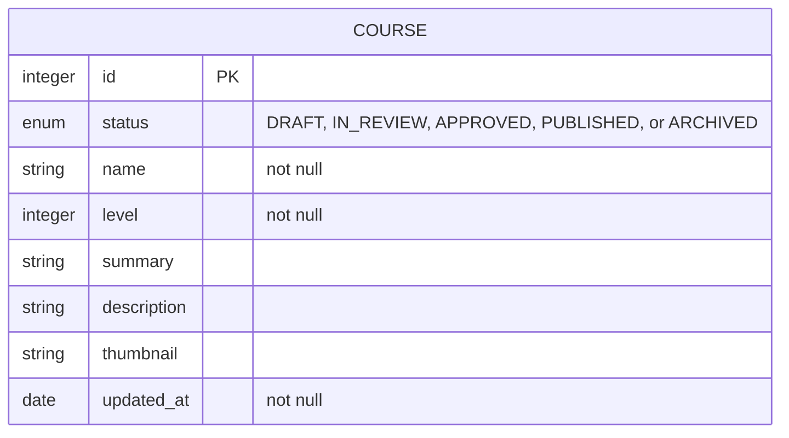
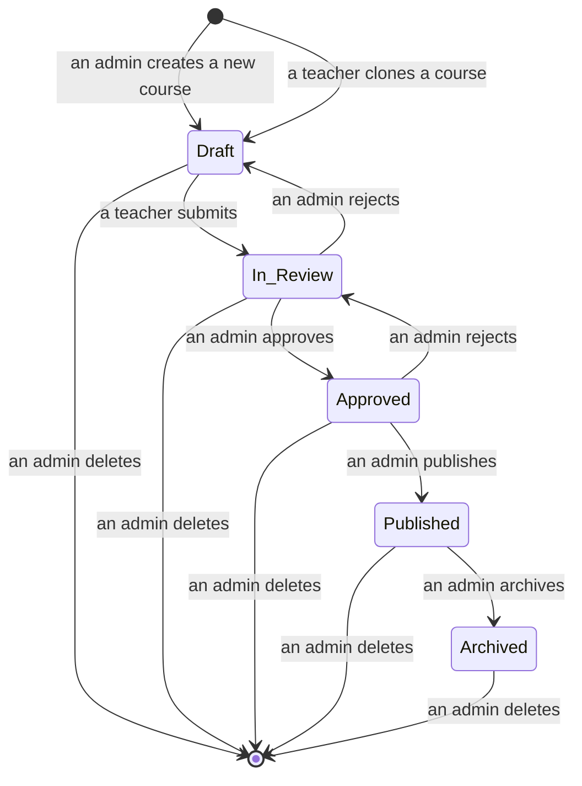

## COURSE

A course is a collection of lessons.  
Courses are designed by teachers.  
Courses are ranked based on difficulty.

### Diagram



### SQL

```sql
CREATE TYPE COURSE_STATUS AS ENUM ('DRAFT', 'IN_REVIEW', 'APPROVED', 'PUBLISHED', 'ARCHIVED');
CREATE TABLE COURSE (
    id SERIAL PRIMARY KEY,
    status COURSE_STATUS,
    title VARCHAR(255) NOT NULL,
    level INT NOT NULL,
    summary VARCHAR(255),
    description TEXT,
    thumbnail VARCHAR(255),
    updated_at timestamp default current_timestamp
);
```

### Course status, version, and instance

A course can be in one of the following `status`es:

- `DRAFT`: the course is being composed/edited and not yet submitted for review
- `IN_REVIEW`: the course has been submitted to admins for review
- `APPROVED`: the course has been approved by (at least) one of the admins
- `PUBLISHED`: the course has been published (i.e. available for studying)
- `ARCHIVED`: the course has been archived (i.e. no longer available for studying)



Description:

- When a new course first get created, it will have `status` of `DRAFT`. The responsible teacher can edit this course.
- After the responsible teacher submits the course for review, the `status` will change to `IN_REVIEW`. Hereafter, the teacher can no longer edit the course.
- If an admin rejects an `IN_REVIEW` course, the status will change back to `DRAFT`, and the responsible teacher can edit the course again.
- If an admin approves the course, the `status` will change to `APPROVED`. At this stage, admins still cannot assign the course to any students for studying.
- If an admin `publish` an `APPROVED` course, the `status` will change to `PUBLISHED` and admins can assign the course to students.
- Only one course among courses with the same name can be `PUBLISHED`. The previous `PUBLISHED` course, if existed, will be changed to `ARCHIVED`, if a new course with the same name get published. Course assignment table (i.e. `COURSE_STUDENT`) will be updated to replace the previously `PUBLISHED` course with the newly `PUBLISHED` course. `ARCHIVED` courses cannot be assigned to students for studying.

Notes:

- Teachers may create a `DRAFT` course by copying a course of any status to which he/she has permission. The database row will be copied except for the `id`.
- Courses of `DRAFT`, `IN_REVIEW` or `APPROVED` status will be automatically deleted if not modified for more than 6 months. Notification of deletion will be sent to stakeholders (e.g. via email). Warning notitication will be sent one month before that.
